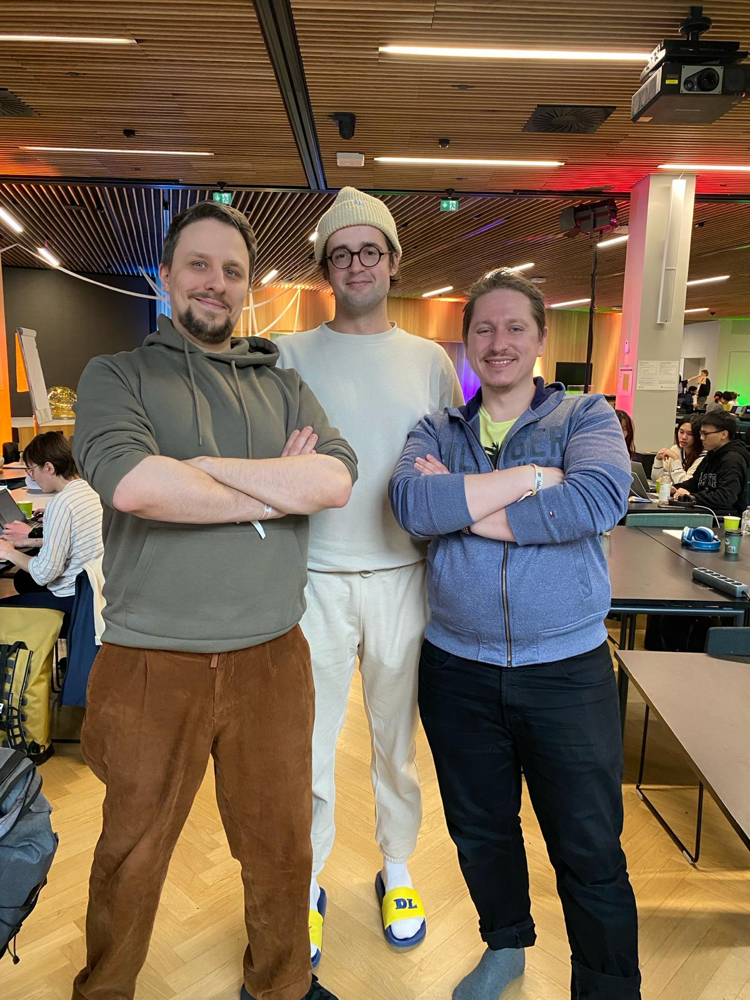

# ASI team

[Solve the SDGS 2024 hackaton](https://www.solvethesdgs.com/)

### Vihreä Suomi Quests: Sustainable Adventures Await

Discover a new era of travel with Vihreä Suomi Quests, the ultimate platform for sustainable adventures. Immerse yourself in quests crafted by experienced locals, blending culture with eco-friendly practices. Whether you're a traveler seeking unique experiences, a travel professional looking to share your expertise, or a facility owner aiming to monetize your space, our platform connects and benefits all. Dive into a world where travel meets sustainability and every journey enriches our planet. Join Vihreä Suomi Quests today and transform the way you explore.

### App views

* [Player view](https://asi-psi.vercel.app/)
* [Quest master view](https://asi-psi.vercel.app/master)
  
### ASI Team in person

From left to right

- https://github.com/pseudopirate
- https://github.com/aarnipavlidi
- https://github.com/hostmepanda




### How to run the app

Install [NodeJs](https://nodejs.org/en/learn/getting-started/how-to-install-nodejs) and run commands below

```bash
cd ui

npm i

npm start
```
